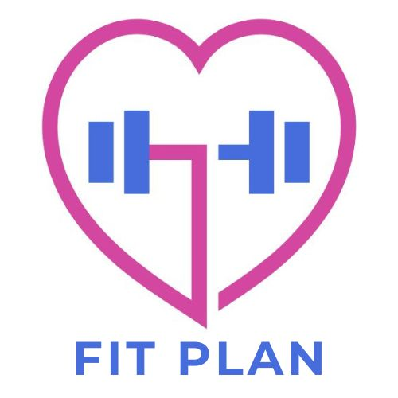

# FitPlan 💪 

Sistem rekomendasi kebugaran cerdas yang memberikan saran latihan, alat, dan diet personal berdasarkan data pengguna menggunakan Machine Learning.

[](https://fitplan.streamlit.app/)

---

## 💡 Deskripsi Proyek

FitPlan AI adalah aplikasi web yang dibangun dengan Streamlit untuk membantu pengguna mendapatkan rekomendasi rencana kebugaran yang disesuaikan. Pengguna memasukkan data dasar (usia, tinggi, berat, jenis kelamin, riwayat penyakit), dan aplikasi akan:

1.  Menghitung **BMI** dan menentukan **Level Kebugaran** (Underweight, Normal, Overweight, Obese).
2.  Menentukan **Tujuan Kebugaran** (Weight Gain/Loss) secara otomatis berdasarkan Level.
3.  Memprediksi **Tipe Latihan** yang cocok (Muscular Fitness/Cardio Fitness) menggunakan model **K-Nearest Neighbors (KNN)**.
4.  Memberikan rekomendasi **detail** mengenai **Latihan Spesifik**, **Alat** yang dibutuhkan, dan **Rencana Diet** (Sayuran, Protein, Jus) menggunakan metode **Content-Based Filtering (CBF)** sederhana berdasarkan modus/voting dari data yang paling cocok.

---

## ⚙️ Cara Kerja

1.  **Input Data Pengguna:** Melalui sidebar Streamlit (Usia, Tinggi (cm), Berat (kg), Jenis Kelamin, Riwayat Hipertensi, Riwayat Diabetes).
2.  **Kalkulasi Otomatis:** BMI, Level Kebugaran, dan Tujuan Kebugaran dihitung berdasarkan input.
3.  **Prediksi KNN:** Input lengkap (termasuk hasil kalkulasi) digunakan untuk memprediksi Tipe Latihan (`Muscular Fitness` atau `Cardio Fitness`). Model KNN dilatih sebelumnya menggunakan data karakteristik pengguna dan tipe latihan yang sesuai.
4.  **Rekomendasi CBF (Mode):** Berdasarkan Tipe Latihan hasil prediksi dan Riwayat Penyakit pengguna, aplikasi memfilter *database* rekomendasi (`preparation_data.pkl`). Aplikasi kemudian mengambil beberapa rekomendasi teratas yang paling cocok dan menentukan Latihan, Alat, serta Diet final berdasarkan **modus (nilai yang paling sering muncul)** dari rekomendasi teratas tersebut.
5.  **Output:** Tampilan rekomendasi berupa kartu-kartu interaktif (Latihan, Alat, Diet) yang bisa diklik untuk melihat detail (deskripsi, tips/kandungan, video).

---

## 📁 Struktur Repositori


├── models/             # Folder berisi file model .pkl
│   ├── knn_model.pkl
│   ├── label_encoders.pkl
│   ├── target_encoder.pkl
│   ├── scaler.pkl
│   ├── preparation_data.pkl # Database rekomendasi (sudah dibersihkan)
├── media/              # Folder berisi gambar untuk rekomendasi
│   ├── squats.jpg
│   ├── dumbbells.jpg
│   ├── carrots.jpg
│   └── ... (gambar lainnya) ...
├── .gitignore          
├── app.py              # Kode utama aplikasi Streamlit
├── models.ipynb        # Notebook Google Colab untuk training model
├── media.py            # Script Python untuk mapping nama item ke path gambar
├── media_info.py       # Script Python berisi detail (deskripsi, tips, youtube)
├── requirements.txt    # Daftar library Python yang dibutuhkan
├── logo.jpg            # File logo aplikasi├── landing.jpg         # (Opsional) Gambar untuk halaman awal
└── README.md    

---

## 🚀 Menjalankan Secara Lokal

Pastikan Anda sudah menginstal Python (disarankan versi 3.9+).

1.  **Clone Repository:**
    ```bash
    git clone [https://github.com/khansartz/exercie-recommender.git](https://github.com/khansartz/exercie-recommender.git)
    cd exercie-recommender
    ```

2.  **(Sangat Direkomendasikan) Buat Virtual Environment:**
    ```bash
    python -m venv venv
    # Aktivasi (Windows):
    .\venv\Scripts\activate
    # Aktivasi (Mac/Linux):
    source venv/bin/activate
    ```

3.  **Instal Library yang Dibutuhkan:**
    ```bash
    pip install -r requirements.txt
    ```
    *(Pastikan file `requirements.txt` berisi: `streamlit`, `pandas`, `joblib`, `Pillow`, `requests`, `scikit-learn`)*

4.  **Jalankan Aplikasi Streamlit:**
    ```bash
    streamlit run app.py
    ```
    Aplikasi akan terbuka otomatis di browser Anda.

---

## 🛠️ Teknologi yang Digunakan

* **Python:** Bahasa pemrograman utama.
* **Streamlit:** Framework untuk membangun aplikasi web.
* **Pandas:** Untuk manipulasi data.
* **Scikit-learn:** Untuk model KNN, preprocessing (LabelEncoder, StandardScaler).
* **Joblib:** Untuk menyimpan dan memuat model machine learning (`.pkl`).
* **Pillow:** Untuk pemrosesan gambar.
* **Requests:** Untuk mengambil gambar dari URL (jika ada).

---

